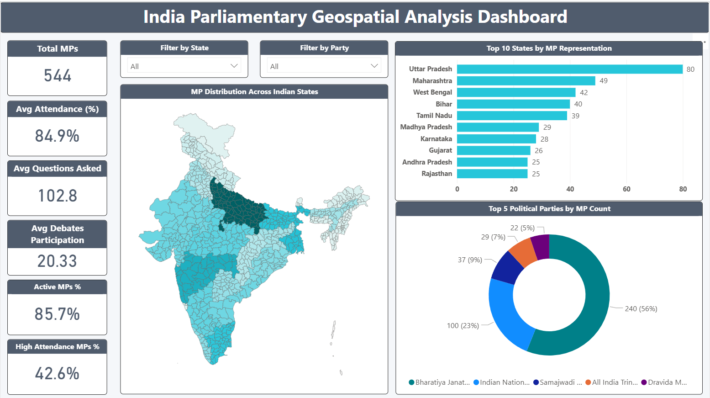
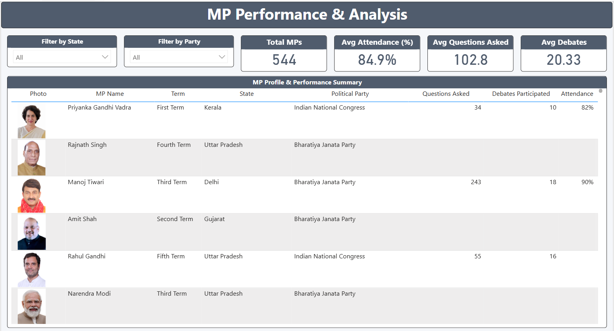

# 📊 India Parliamentary Geospatial Analysis Dashboard

🚀 End-to-end data project combining web scraping, data augmentation, and geospatial visualization using Power BI.

---

## 🎯 Project Overview

This project extracts and augments data of Members of Parliament (MPs) from PRS India and builds an **interactive geospatial dashboard** using Power BI.

The dashboard focuses on:

- State-wise MP distribution
- MP-level performance analysis
- Party-level insights

---

## 🔥 Key Highlights

- ✅ Web scraping using Python
- ✅ DOM inspection & CSS selector usage
- ✅ Data augmentation with MP profile images
- ✅ Geospatial visualization using Shape Maps
- ✅ Clean, insight-driven dashboard design

---

## ⚙️ Workflow

### 1. Data Augmentation
- Clean MP names into URL format
- Handle inconsistencies using manual mapping
- Extract profile images using web scraping

### 2. HTML & DOM Parsing
- Used BeautifulSoup to locate image elements
- CSS selector used:

### 3. Data Processing
- Converted relative paths to full URLs
- Generated enriched dataset

### 4. Dashboard Creation (Power BI)
- Shape Map (India states)
- KPI-based summary
- MP-level analysis with images

---

## 🗺️ Shape Map (Geospatial Analysis)

- Custom TopoJSON file used
- State-level aggregation of MPs
- Color gradient used to indicate density

---

## 📷 Dashboard Screenshots

### 🔹 Geospatial Overview

### 🔹 MP Analysis

---

## ⚠️ Note on Data Availability

Due to system and organizational restrictions:

- Dataset is not uploaded
- Power BI file (.pbix) is not included

Screenshots are provided for demonstration.

---

## 📁 Project Structure

data/       → Dataset description
notebooks/  → Scraping notebook
maps/       → TopoJSON file
dashboard/  → Dashboard explanation
images/     → Dashboard visuals

---

## 🔮 Future Improvements

- Add Party & Performance analysis page
- Drill-through functionality for MPs
- Trend analysis
- Advanced KPI comparison (state vs national)

---

## 🧭 Architecture

Python (Scraping Layer)
↓
Processed Data (CSV)
↓
Power BI Dashboard
↓
Geospatial + Analytical Insights

---
